# 医院软件 CRM + 项目管理系统实施计划

## 业务背景

公司从事**医院软件**业务，包含**咨询**和**实施**两阶段，每个客户合同对应一个实施项目。需要一套统一平台：

- **销售团队**使用 CRM 模块：管理客户录入、跟进（含面访）、合同
- **项目团队**使用项目管理模块：项目管理员统筹人员与团队；项目经理负责阶段与任务
- **两模块数据关联**：合同签约后创建/关联项目；销售在合同页面可**只读**查看项目实施情况

## 系统架构

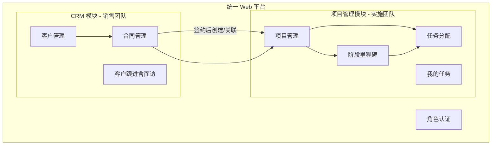


**统一平台，角色分视图**：所有用户登录同一系统，根据角色看到不同菜单和功能权限。

## 用户角色与权限

> 以下为**默认权限模板**，上线后可在「系统配置模块」中按角色 × 资源 × 操作灵活调整。


| 角色                      | 主要模块               | 默认权限范围                                    |
| ----------------------- | ------------------ | ----------------------------------------- |
| `SALES`（销售） | CRM + 移动日志 | 客户/跟进/合同 CRUD；**手机端 Agent 日志**；公海池只读 |
| `SALES_MANAGER`（销售管理）   | CRM + 成本 + 人员      | 销售全部权限 + 公海池 + **销售人员配置**（大类=销售） + 销售成本录入 |
| `PROJECT_ADMIN`（项目管理员）  | 项目管理 + 人员          | **实施人员管理**（大类=实施）、团队配置、售前工作安排、每日工作视图      |
| `PROJECT_MANAGER`（项目经理） | 项目管理 + 部分 CRM + 成本 | 负责项目的阶段/任务管理；可查看关联合同；**项目成本录入**           |
| `PROJECT_STAFF`（项目人员）   | 项目管理               | 咨询/实施/开发人员执行任务；可查看客户基本信息；**不可查看合同**       |
| `ADMIN`（管理员）            | 全部 + 配置            | 所有模块读写，用户管理，**系统配置**                      |


> **登录角色**决定系统权限；**人员大类**（销售/实施）决定由谁管理其档案。所有用户均可被配置。

## 技术选型


| 层级   | 选择                                   | 理由                |
| ---- | ------------------------------------ | ----------------- |
| 前端框架 | Next.js 15 (App Router) + TypeScript | 全栈一体，单平台多模块       |
| UI   | Tailwind CSS + shadcn/ui             | 专业界面，响应式支持手机端面访打卡 |
| 数据库  | SQLite（开发）/ PostgreSQL（生产）           | Prisma 可无缝切换      |
| ORM  | Prisma                               | 类型安全，关联查询方便       |
| 认证 | NextAuth.js + 角色中间件 | 邮箱密码登录 + 路由级权限控制 |
| AI Agent | Vercel AI SDK + 大模型 API | 销售日志对话采集、结构化提取、工具调用 |
| 工具能力 | Web Search API + OCR（图片识别） | 新客户核验、医院/渠道工商信息补全 |


项目创建在 `~/Projects/hospital-crm-pm`，初始化 Git 仓库。

## 核心数据模型

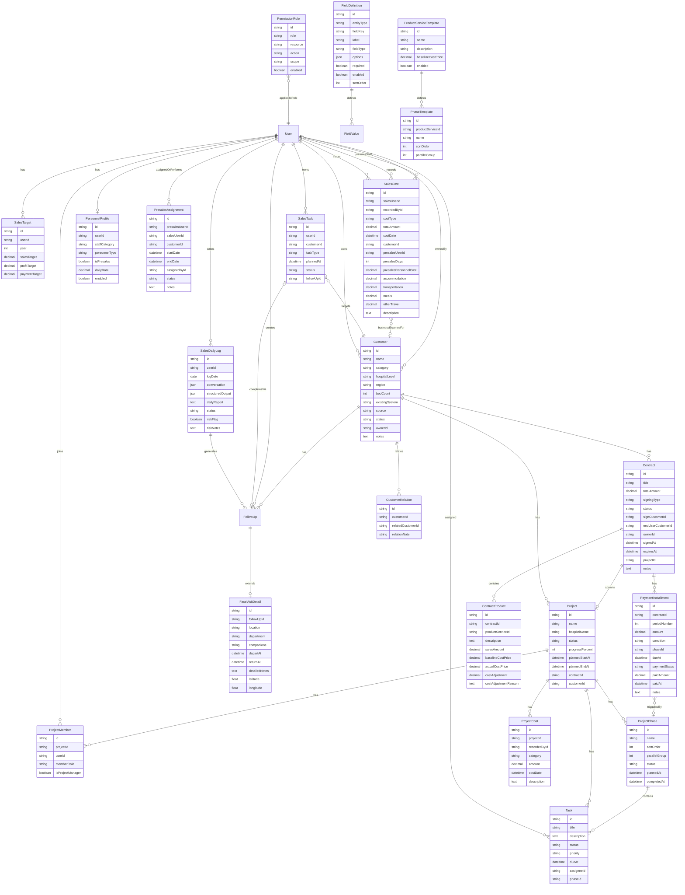


### 关键关联规则

- **客户 → 合同 → 项目**：一个客户可有多个合同；同一客户在不同合同中可以是直接签约方或间接签约方（见合同模块）
- **客户关联**：客户之间通过 `关联客户` 多对多关联（介绍关系、渠道关系等），不在客户层区分直接/间接
- **可配置字段**：各模块内置字段 + 管理员在配置中心新增的自定义字段
- **可配置权限**：默认角色权限模板，管理员可在配置中心调整
- **项目阶段来源**：合同产品/服务 → 配置中心阶段模板 → 自动合并生成 → 项目经理可自定义
- **并行阶段**：同一 `parallelGroup` 的阶段可并行推进，不同组按顺序推进
- **毛利核算**：合同毛利（销售价 − 产品实际成本）− 销售日常成本（销售管理录入）

### 状态枚举

**客户状态**：`线索` → `意向` → `洽谈中` → `已签约` → `已流失`

**合同状态**（独立流转，与回款状态分开）：

```
待签署 → 已签署待实施 → 实施中 → 已验收 → 维保中 → 已终止
```

**回款状态**（独立字段，按分期管理，不纳入合同状态）：

每期回款：`未回款` / `部分回款` / `已回款`；合同整体回款进度由分期汇总计算

**项目状态**（与合同状态对齐）：

```
待启动 → 实施中 → 已验收 → 维保中 → 已关闭
```

**项目阶段**：不固定，由合同所选产品/服务在配置中心的阶段模板自动带出，项目经理可在创建时自定义；支持并行阶段

**阶段状态**：`未开始` → `进行中` → `已完成`

**任务状态**：`待处理` → `进行中` → `已完成` → `已阻塞`

## 模块详细设计（逐个讨论）

> 以下各模块经讨论后逐步完善，✅ 已确认，⏳ 待讨论

### 1. 客户管理模块 ✅ 已确认（v3）

#### 客户主体定义

- **跟进最小单位**：以**客户**为单位（一家医院 = 一条客户记录），不按科室拆分
- **医疗集团 / 医联体**：各自为独立客户记录，不做集团层级管理
- **客户类别**（`category`）：三种 — `医院` / `公司` / `个人`
- **直接/间接区分**：**不在客户层体现**。同一客户在不同合同中可能是直接签约方或间接签约方，此逻辑放在**合同模块**处理

#### 销售漏斗（客户状态）

```
线索 → 意向 → 洽谈中 → 已签约 → 已流失
```

#### 客户内置字段（固定字段）


| 字段     | 必填    | 说明                                             |
| ------ | ----- | ---------------------------------------------- |
| 客户名称   | ✅     | 医院名或公司名                                        |
| 客户类别   | ✅     | `医院` / `公司` / `个人`                             |
| 医院等级   | 医院时必填 | `三甲` / `三乙` / `三级` / `二甲` / `二乙` / `二级` / `其他` |
| 所在地区   | ✅     | 省 / 市 / 区                                      |
| 床位数    |       | 医院规模参考                                         |
| 现有信息系统 |       | 竞品名称 / 自研 / 无                                  |
| 客户来源   |       | 展会 / 转介绍 / 陌拜 / 招标 / 其他（**选填**）                |
| 关联客户   |       | 关联其他客户记录（多对多），用于介绍关系、渠道关系等                     |
| 负责销售   |       | 分配的销售人员；为空 = 在公海池                              |
| 备注     |       | 自由文本                                           |


> 除以上内置字段外，管理员可通过**系统配置模块**为客户新增自定义字段（文本、下拉、数字、日期等）。

#### 关联客户

- 一个客户可关联**多个其他客户**（多对多，双向）
- 用途：记录介绍关系（A 介绍 B）、渠道关系（渠道公司关联多家医院）等
- 关联时可填写备注说明关系（如「渠道介绍」「集团关联」）
- 筛选支持：按关联客户反查

#### 联系人管理

一个客户可关联**多个联系人**（联系人所属科室仅作备注，不拆客户）：


| 字段      | 说明                     |
| ------- | ---------------------- |
| 姓名      | 联系人姓名                  |
| 职务      | 如信息科主任                 |
| 所属科室    | 信息科 / 护理部等（备注用途）       |
| 电话 / 邮箱 | 联系方式                   |
| 角色类型    | `决策人` / `技术对接人` / `其他` |
| 是否主要联系人 | 标记默认联系人                |


#### 公海池与归属管理

- 未分配销售负责人的客户进入**公海池**
- **销售管理人员**统一管理公海池：查看、分配、回收
- 若无销售管理人员，由**管理员**代为操作
- 销售只能操作自己负责的客户；公海池客户只读，或被分配后归属该销售

#### 客户列表筛选维度


| 筛选项  | 说明                               |
| ---- | -------------------------------- |
| 客户状态 | 线索 / 意向 / 洽谈中 / 已签约 / 已流失        |
| 客户类别 | 医院 / 公司 / 个人                     |
| 所在地区 | 省 / 市                            |
| 医院等级 | 三甲 / 三乙 / 三级 / 二甲 / 二乙 / 二级 / 其他 |
| 负责销售 | 按销售人员筛选                          |
| 公海池  | 快速查看未分配客户                        |
| 关联客户 | 按关联的客户筛选                         |
| 回款情况 | 按关联合同的回款状态筛选（未回款 / 部分回款 / 已结清）   |


#### 权限规则（客户模块 — 默认模板，可配置）


| 角色   | 客户信息              | 合同信息          |
| ---- | ----------------- | ------------- |
| 销售   | 自己负责的客户读写；公海池只读   | 自己负责客户的合同读写   |
| 销售管理 | 全部客户读写 + 公海池管理    | 全部合同查看        |
| 项目经理 | 关联项目客户的**基本信息**只读 | **可查看**关联项目合同 |
| 项目人员 | 关联项目客户的**基本信息**只读 | **不可查看**合同    |
| 管理员  | 全部                | 全部            |


---

### 9. 系统配置模块 ✅ 已确认（概要）

> 管理员专用，用于灵活调整系统行为，无需改代码。

#### 9.1 字段配置

- 按实体类型管理字段：客户 / 合同 / 项目 / 任务 / 联系人 等
- 每个字段可配置：名称、类型（文本/下拉/数字/日期/多行文本）、是否必填、是否启用、排序
- 下拉类型可配置选项列表（如客户来源、医院等级等枚举也可在此维护）
- 内置字段（如客户名称、客户类别）可配置是否显示/是否必填，但不可删除
- 支持新增**自定义字段**，数据以 JSON 或 EAV 模式存储

#### 9.2 权限配置

- 权限矩阵：`角色` × `资源`（客户/合同/项目/任务/公海池/配置） × `操作`（查看/新增/编辑/删除/分配）
- 数据范围：`仅自己负责的` / `团队全部` / `全部`
- 提供默认权限模板（即上文各模块的默认规则），管理员可逐项开关
- 修改后立即生效，无需重启

#### 9.4 产品/服务与项目阶段配置

- 在配置中心维护**产品/服务目录**（如 ICU 系统、护理系统、实施服务、维保服务等）
- 每个产品/服务配置：**基准成本价** + 阶段模板
- 并行阶段通过 `parallelGroup` 标识：相同组号的阶段可同时推进，不同组按组顺序推进


| 配置项     | 说明                     |
| ------- | ---------------------- |
| 产品/服务名称 | 如「重症监护系统」「实施服务」        |
| 基准成本价   | 该产品/服务的标准成本，录入合同时作为默认值 |
| 阶段名称    | 如「需求调研」「系统部署」「数据迁移」    |
| 排序      | 阶段组的前后顺序               |
| 并行组号    | 同组并行，留空则独立顺序阶段         |


示例（实施服务）：


| 阶段   | 排序  | 并行组 |
| ---- | --- | --- |
| 项目启动 | 1   | —   |
| 需求调研 | 2   | —   |
| 系统部署 | 3   | A   |
| 数据迁移 | 3   | A   |
| 用户培训 | 4   | —   |
| 项目验收 | 5   | —   |


> 「系统部署」和「数据迁移」并行组号均为 A，可同时进行。

#### 9.5 枚举/选项配置

- 统一管理各模块下拉选项：客户状态、医院等级、合同状态、跟进方式、跟进结果等
- 管理员可增删改选项值，前端表单和筛选器自动同步

#### 9.6 销售年度目标与毛利核算

- 销售管理/管理员为每位销售设定年度目标：销售额、毛利、回款
- 支持按年度管理，每年可重设

**毛利核算公式**：

```
销售年度毛利 = 合同毛利总和 − 销售日常成本总和

其中：
  合同毛利（单笔）= 合同销售金额 − 合同产品实际成本总和
  销售日常成本     = 个人差旅 + 售前费用 + 商务费用（销售管理录入）
```


| 指标  | 目标来源   | 实际数据来源           |
| --- | ------ | ---------------- |
| 销售额 | 年度目标设定 | 当年已签署合同销售金额汇总    |
| 毛利  | 年度毛利目标 | 合同毛利总和 − 已录入销售成本 |
| 回款  | 年度回款目标 | 当年实际到账金额汇总       |


#### 9.7 人员大类与售前标签

- **人员大类**：`销售` / `实施`（管理员分配，决定管理归属）
- **实施人员类型**：`项目经理` / `咨询` / `实施` / `开发`（项目管理员维护）
- **售前标签**：仅对实施大类人员，打标签后维护日单价，用于售前费用与工作安排

---

### 2. 客户跟进模块（含面访）✅ 已确认

> 面访是客户跟进的一种方式，选择「面访」时展开额外字段，不再作为独立模块。

#### 跟进方式

在配置模块维护，内置包含：**电话 / 微信 / 面访 / 线上会议 / 其他**

- 选择「面访」时，表单展开面访专属字段
- 其他方式只填写基础跟进字段

#### 基础跟进字段（所有方式通用）


| 字段     | 必填  | 说明                                |
| ------ | --- | --------------------------------- |
| 关联客户   | ✅   | 跟进的客户                             |
| 关联联系人  |     | 本次沟通的具体联系人                        |
| 跟进方式   | ✅   | 电话 / 微信 / 面访 / 线上会议 / 其他          |
| 跟进内容   | ✅   | 沟通记录摘要                            |
| 跟进时间   | ✅   | 实际跟进日期时间                          |
| 跟进结果   | ✅   | 如「有意向推进 / 无进展 / 需再约」等（**配置模块维护**） |
| 下次跟进时间 |     | 计划下次跟进日期，用于提醒                     |
| 建议客户状态 |     | 根据跟进结果系统**建议**更新的客户状态（销售确认后生效）    |
| 跟进人    | ✅   | 自动记录当前登录销售                        |


#### 面访专属字段（仅跟进方式 = 面访 时展示）


| 字段     | 必填  | 说明                 |
| ------ | --- | ------------------ |
| 面访地点   | ✅   | 医院/公司地址            |
| 拜访科室   |     | 如信息科、护理部           |
| 同行人员   |     | 一同前往的同事            |
| 出发时间   |     | 出发时间               |
| 返回时间   |     | 返回时间               |
| 详细面访纪要 | ✅   | 比普通跟进内容更完整的现场记录    |
| GPS 定位 |     | 到达时打卡定位（手机端），记录经纬度 |


- 面访数据作为跟进记录的扩展子表（`FaceVisitDetail`），一条跟进记录最多对应一条面访详情
- 客户详情页时间线中，面访记录带「面访」标签，可展开查看地点、科室、GPS 等详情
- 销售也可通过**每日日志 Agent 对话**自动生成跟进/面访记录（见 §9 销售日志模块）

#### 跟进与客户状态联动

- 跟进记录和客户状态**不自动绑定**
- 填写跟进结果后，系统根据规则**建议**更新客户状态（如「有意向推进」→ 建议改为「意向」）
- 销售在确认提示中**一键采纳或忽略**，避免误改

#### 待跟进提醒


| 入口      | 说明                                        |
| ------- | ----------------------------------------- |
| 销售仪表盘   | 「今日待跟进」「逾期未跟进」快捷卡片                        |
| 独立待跟进页面 | `/follow-ups`，按下次跟进时间排序，支持筛选负责人/客户状态/跟进方式 |


- 逾期未跟进（过了下次跟进时间未完成）高亮标红
- 完成一次跟进后，若填写了下次跟进时间，自动生成新的待办
- **销售日志提交率**（销售管理视角：团队今日是否已填日志）
- **下次跟进时间**可自动生成为「本周销售任务」

#### 本周销售任务（与跟进联动）


| 字段     | 说明               |
| ------ | ---------------- |
| 关联客户   | 目标客户             |
| 任务类型   | 待拜访 / 待沟通 / 待回访  |
| 计划日期   | 计划在本周哪天完成        |
| 关联联系人  | 可选               |
| 备注     | 任务说明             |
| 状态     | 待完成 / 已完成        |
| 关联跟进记录 | 完成后关联的跟进/面访记录 ID |


- 任务列表在销售仪表盘「本周任务」区块展示
- 点击「完成」→ 弹出跟进/面访表单（预填客户和联系人）→ 保存后任务完成并双向关联

#### 权限


| 角色   | 权限                  |
| ---- | ------------------- |
| 销售   | 自己负责客户的跟进 CRUD（含面访） |
| 销售管理 | 团队全部客户跟进查看          |
| 其他角色 | 不可操作跟进              |


---

### 3. 合同管理模块 ✅ 已确认

#### 合同分类（两个维度）


| 维度                      | 说明                                                    |
| ----------------------- | ----------------------------------------------------- |
| **签约方式**（`signingType`） | `直接合同`（签约方 = 最终使用客户）/ `间接合同`（签约方 ≠ 最终使用客户，如渠道签约、医院使用） |
| **产品/服务类型**             | 在**系统配置模块**维护，每个产品/服务配置对应的项目阶段模板；一份合同可含多条产品明细         |


#### 合同关联客户


| 字段     | 必填  | 说明                             |
| ------ | --- | ------------------------------ |
| 签约方    | ✅   | 关联客户记录（医院/公司/个人）               |
| 最终使用客户 | ✅   | 关联客户记录；直接合同时可与签约方相同，间接合同时为终端医院 |


#### 合同状态流转

```
待签署 → 已签署待实施 → 实施中 → 已验收 → 维保中 → 已终止
```

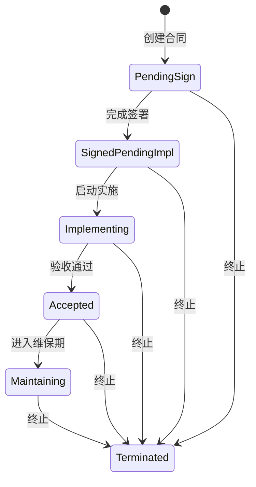


- 任何阶段均可流转至「已终止」
- 「已签署待实施」时可**一键创建关联项目**
- 合同状态变更以人工操作为主，部分节点可与项目阶段联动（如项目启动 → 实施中）

#### 合同内置字段


| 字段     | 必填  | 说明          |
| ------ | --- | ----------- |
| 合同标题   | ✅   | 合同名称        |
| 签约方式   | ✅   | 直接合同 / 间接合同 |
| 签约方    | ✅   | 关联客户        |
| 最终使用客户 | ✅   | 关联客户        |
| 合同总金额  | ✅   | 汇总金额        |
| 合同状态   | ✅   | 见上方状态流转     |
| 合同负责人  | ✅   | 负责该合同的销售人员  |
| 签约日期   |     | 实际签署日期      |
| 生效日期   |     | 合同生效日期      |
| 到期日期   |     | 合同到期日期      |
| 关联项目   |     | 签约后创建/关联项目  |
| 合同附件   |     | PDF 扫描件等    |
| 备注     |     | 自由文本        |


#### 产品/服务明细

一份合同可包含多条产品明细，每条关联配置中心的产品/服务：


| 字段      | 说明                           |
| ------- | ---------------------------- |
| 产品/服务类型 | 从配置模块选择，自动带入**基准成本价**        |
| 描述      | 产品/服务说明                      |
| 销售金额    | 该行对外销售价                      |
| 基准成本价   | 来自配置，录入时自动填充（只读参考）           |
| 实际成本价   | 可在基准价基础上调整，默认 = 基准成本价        |
| 调整额度    | 实际成本价 − 基准成本价（自动计算，正=上浮负=下浮） |
| 调整原因    | 调整时**必填**说明原因                |
| 行毛利     | 销售金额 − 实际成本价（自动计算）           |


- 合同总毛利 = 各行毛利之和

#### 合同毛利汇总


| 指标     | 计算方式            |
| ------ | --------------- |
| 合同销售金额 | 各行销售金额之和        |
| 合同产品成本 | 各行实际成本价之和       |
| 合同毛利   | 合同销售金额 − 合同产品成本 |


#### 回款管理（独立字段，不纳入合同状态）

回款分两个层级：**合同整体回款概况** + **分期回款明细**。

##### 合同整体回款概况（汇总视图）

在合同列表和合同详情顶部展示，由分期数据自动汇总计算：


| 指标     | 说明                          | 示例    |
| ------ | --------------------------- | ----- |
| 合同总金额  | 合同约定的总金额                    | 100 万 |
| 已回款金额  | 各期实际回款金额之和                  | 60 万  |
| 未回款金额  | 合同总金额 − 已回款金额               | 40 万  |
| 回款进度   | 已回款 / 合同总金额 × 100%          | 60%   |
| 整体回款状态 | 自动判定：`未回款` / `部分回款` / `已结清` | 部分回款  |


- 合同列表增加「回款进度」列（进度条 + 金额，如 `60万/100万`）
- 合同详情「回款计划」Tab 顶部展示汇总卡片
- 客户列表的「回款情况」筛选基于整体回款状态

##### 分期回款明细


| 字段     | 说明                          |
| ------ | --------------------------- |
| 期数     | 第 1 期、第 2 期…                |
| 回款金额   | 该期应回金额                      |
| 回款条件   | 文字描述（如「合同签署后」「验收通过后」）       |
| 关联项目节点 | 可选，关联项目实施阶段（如「项目验收」阶段完成后触发） |
| 计划回款时间 | 预计回款日期                      |
| 回款状态   | `未回款` / `部分回款` / `已回款`      |
| 实际回款金额 | 已收到金额                       |
| 实际回款时间 | 到账日期                        |
| 备注     | 回款说明                        |


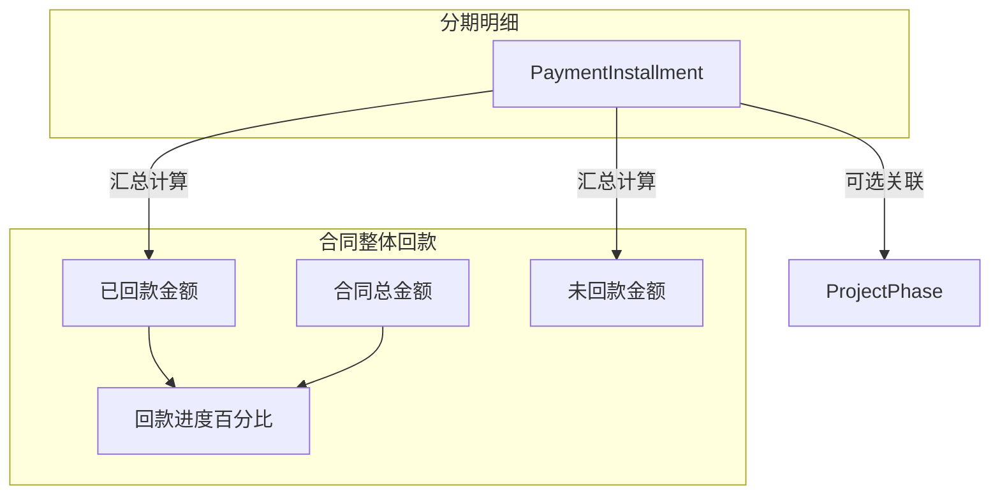


- 合同详情页独立展示「回款计划」Tab（顶部汇总 + 下方分期列表）
- 关联项目节点后，当项目实施到对应阶段时可提醒回款

#### 合同详情页结构


| Tab  | 内容                   | 访问权限             |
| ---- | -------------------- | ---------------- |
| 基本信息 | 合同字段、签约方、最终使用客户、产品明细 | 销售、销售管理、项目经理、管理员 |
| 回款计划 | 整体回款概况 + 分期回款列表、关联节点 | 销售、销售管理、项目经理、管理员 |
| 项目实施 | 项目进度、阶段、任务动态（只读）     | 销售只读；项目经理可跳转编辑   |
| 附件   | 合同扫描件                | 有合同查看权限的角色       |


#### 权限规则（合同模块 — 默认模板，可配置）


| 角色   | 合同查看     | 合同编辑  | 回款管理  | 项目实施 Tab |
| ---- | -------- | ----- | ----- | -------- |
| 销售   | 自己负责的    | 自己负责的 | 自己负责的 | 只读       |
| 销售管理 | 全部       | 全部    | 全部    | 只读       |
| 项目经理 | 关联项目的    | 不可编辑  | 查看    | 可跳转项目    |
| 项目人员 | **不可查看** | 不可    | 不可    | 不可       |
| 管理员  | 全部       | 全部    | 全部    | 全部       |


#### 合同列表筛选维度


| 筛选项    | 说明                                   |
| ------ | ------------------------------------ |
| 合同状态   | 待签署 / 已签署待实施 / 实施中 / 已验收 / 维保中 / 已终止 |
| 签约方式   | 直接 / 间接                              |
| 签约方    | 按客户筛选                                |
| 最终使用客户 | 按客户筛选                                |
| 合同负责人  | 按销售筛选                                |
| 回款情况   | 未回款 / 部分回款 / 已结清                     |
| 产品类型   | 按产品/服务类型筛选                           |


---

### 4. 项目管理模块 ✅ 已确认

#### 项目创建

支持两种方式：


| 方式     | 说明                         |
| ------ | -------------------------- |
| 合同一键创建 | 合同状态为「已签署待实施」时，一键创建项目并自动关联 |
| 手动创建   | 项目经理手动创建，再选择关联合同           |


创建时自动带入：最终使用客户信息、合同产品/服务明细。

#### 项目阶段（由产品/服务驱动）

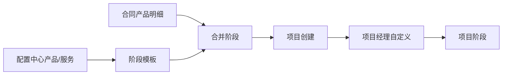


**阶段生成规则**：

1. 读取合同中所有产品/服务明细
2. 从配置中心查找每个产品/服务对应的阶段模板
3. **全部保留**各产品/服务的阶段，标注来源（如「需求调研（ICU 系统）」「需求调研（护理系统）」），由项目经理在创建时自行合并/删除
4. 项目经理在创建项目时可：**增删阶段、调整顺序、调整并行组、修改名称**

**并行阶段**：

- 每个阶段有 `parallelGroup` 字段
- 相同并行组号的阶段**可同时推进**
- 不同组按 `sortOrder` 顺序推进
- 项目详情以时间线 + 并行泳道展示


| 阶段状态 | 说明                 |
| ---- | ------------------ |
| 未开始  | 尚未启动               |
| 进行中  | 正在执行（并行组内可同时多个进行中） |
| 已完成  | 阶段完成               |
| 已阻塞  | 遇到问题暂停             |


**整体进度**：已完成阶段组数 / 总阶段组数（并行组算一组）

#### 项目状态（与合同对齐）

```
待启动 → 实施中 → 已验收 → 维保中 → 已关闭
```


| 联动规则   | 说明                  |
| ------ | ------------------- |
| 项目启动   | 合同状态 →「实施中」         |
| 项目验收完成 | 合同状态 →「已验收」（**自动**） |
| 进入维保   | 合同状态 →「维保中」         |
| 项目关闭   | 合同状态 →「已终止」或保持维保中   |


#### 项目团队管理（项目管理员）

项目管理员负责所有项目的团队配置，项目经理负责项目内任务执行：

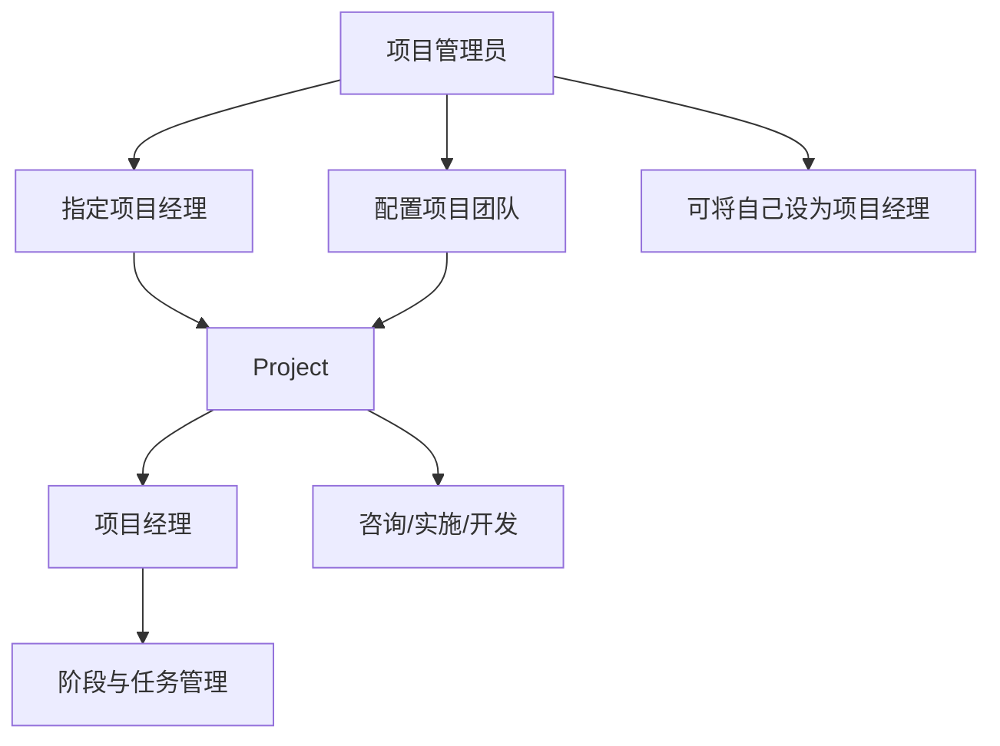


| 操作      | 执行人   | 说明                   |
| ------- | ----- | -------------------- |
| 指定项目经理  | 项目管理员 | 每个项目设置一位项目经理，可从人员库选择 |
| 配置团队成员  | 项目管理员 | 选择咨询、实施、开发人员加入项目     |
| 兼任项目经理  | 项目管理员 | 可将自己指定为某项目的项目经理      |
| 阶段与任务管理 | 项目经理  | 项目内任务创建、分配、审核（不变）    |


**项目团队成员角色**（`memberRole`）：`项目经理` / `咨询` / `实施` / `开发`

- 项目经理字段与成员表中 `isProjectManager` 标记同步
- 项目创建时可由项目管理员完成团队配置，或先创建后配置

#### 项目内置字段


| 字段      | 说明                      |
| ------- | ----------------------- |
| 项目名称    | 默认可从合同/最终使用客户生成         |
| 关联合同    | 关联合同记录                  |
| 最终使用客户  | 从合同带入                   |
| 项目经理    | 由**项目管理员**指定            |
| 项目团队    | 咨询/实施/开发人员，由**项目管理员**配置 |
| 计划开始/结束 | 时间线                     |
| 实际开始/结束 | 时间线                     |
| 整体进度    | 自动计算                    |
| 项目状态    | 见上方                     |
| 备注      | 自由文本                    |


#### 其他核心内容


| 模块     | 说明                      |
| ------ | ----------------------- |
| 阶段里程碑  | 每阶段有计划/实际完成日期           |
| 问题/风险  | 项目级问题记录（描述、严重程度、状态、负责人） |
| 项目文档   | 验收报告、实施方案等附件            |
| 回款节点关联 | 阶段完成可触发关联的回款提醒（见合同模块）   |


#### 项目详情页结构


| Tab   | 内容              |
| ----- | --------------- |
| 概览    | 进度、时间线、团队、状态    |
| 阶段    | 时间线/泳道视图，阶段状态管理 |
| 任务    | 阶段下任务列表         |
| 问题/风险 | 问题跟踪            |
| 文档    | 附件管理            |
| 动态    | 状态变更日志          |


---

### 5. 任务管理模块 ✅ 已确认

#### 任务创建与分配


| 角色    | 权限                                    |
| ----- | ------------------------------------- |
| 项目管理员 | 直接创建任务并分配给项目人员，无需审批                   |
| 项目经理  | 直接创建任务并分配给项目人员，无需审批                   |
| 项目人员  | 可自行创建任务，创建后状态为「**待项目经理确认**」，确认后进入正常流转 |


#### 任务字段


| 字段    | 说明         |
| ----- | ---------- |
| 标题    | 任务名称       |
| 描述    | 详细说明       |
| 关联项目  | 所属项目       |
| 关联阶段  | 所属项目阶段（可选） |
| 负责人   | 项目人员       |
| 优先级   | 高 / 中 / 低  |
| 截止日期  | 计划完成时间     |
| 预估工时  | 预计花费小时数    |
| 实际工时  | 实际花费小时数    |
| 状态    | 见下方流转      |
| 附件    | 相关文件       |
| 备注/评论 | 任务讨论记录     |


#### 任务状态流转

```
待项目经理确认（仅项目人员自建任务） → 待处理 → 进行中 → 待审核 → 已完成
```

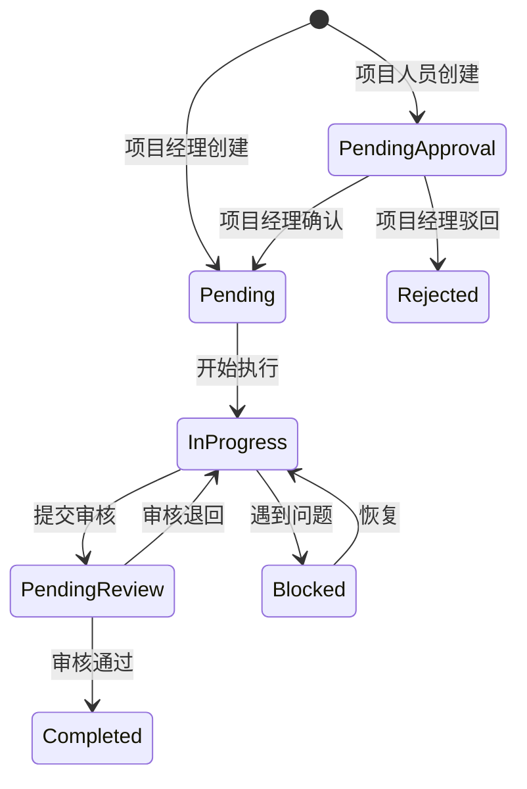


- 项目经理创建的任务直接进入「待处理」
- 项目人员提交完成后进入「待审核」，项目经理审核通过后变为「已完成」
- 遇到阻塞可标记为「已阻塞」

#### 「我的任务」视图（项目人员）

支持**列表**和**看板**两种视图，可切换：


| 视图   | 说明                          |
| ---- | --------------------------- |
| 列表视图 | 按截止日期排序，显示优先级、状态、所属项目/阶段    |
| 看板视图 | 按状态分列：待处理 / 进行中 / 待审核 / 已完成 |


#### 项目经理任务管理

- 项目详情「任务」Tab：查看所有任务，按阶段分组
- 可批量分配、调整优先级
- 审核项目人员提交的待审核任务
- 审批项目人员自建的任务（确认/驳回）

---

### 6. 仪表盘 ✅ 已确认

登录后按角色展示不同仪表盘，首页即对应角色的工作台。

#### 6.1 销售仪表盘


| 区块          | 内容                                    |
| ----------- | ------------------------------------- |
| **年度目标完成度** | 当年销售额、毛利、回款三项指标的目标 vs 实际完成（进度条 + 百分比） |
| 待跟进提醒       | 今日待跟进、逾期未跟进（高亮），可跳转 `/follow-ups`     |
| **本周任务**    | 本周计划拜访/沟通/回访的客户清单，完成后一键关联跟进或面访记录      |
| 客户统计        | 本月新增客户数、各状态分布                         |
| 合同统计        | 本月签约数/金额、各合同状态数量                      |
| 回款统计        | 本月回款金额、负责合同未回款总额                      |
| 项目进度概览      | 已签约待实施合同、关联项目实施进度（**只读**）             |
| 最近动态        | 最近跟进记录时间线（含面访标签）                      |
| **图表**      | 客户漏斗图、回款趋势图、年度目标完成雷达图/柱状图             |


##### 年度目标


| 指标  | 目标来源           | 实际数据来源                |
| --- | -------------- | --------------------- |
| 销售额 | 管理员/销售管理设定年度目标 | 当年已签署合同销售金额汇总         |
| 毛利  | 年度毛利目标         | **合同毛利总和 − 销售日常成本总和** |
| 回款  | 年度回款目标         | 当年实际到账金额汇总            |


- 毛利明细可展开：合同毛利贡献 + 已扣除销售成本列表
- 销售仪表盘顶部展示三个环形进度图或进度条
- 销售管理可为团队每位成员设定/调整年度目标

##### 本周销售任务

销售周任务与客户沟通行为**一一对应**：

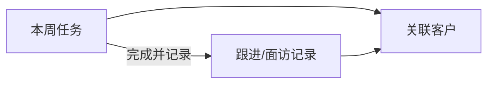


| 任务类型 | 说明           | 完成后                    |
| ---- | ------------ | ---------------------- |
| 待拜访  | 计划面访某客户      | 一键创建「面访」跟进，任务自动标记完成并关联 |
| 待沟通  | 计划电话/微信/会议沟通 | 一键创建对应方式跟进记录并关联        |
| 待回访  | 到期需回访的客户     | 一键创建跟进记录并关联            |


- 任务可手动创建，或由「下次跟进时间」自动生成
- 本周任务列表显示：客户名、任务类型、计划日期、关联联系人
- 完成后跟进记录反向关联任务 ID，可追溯

#### 6.2 销售管理仪表盘

在销售仪表盘基础上，增加**视角切换**：


| 视角    | 说明                          |
| ----- | --------------------------- |
| 我的    | 与销售仪表盘相同                    |
| 团队汇总  | 全团队年度目标完成情况、客户/合同/回款汇总      |
| 按销售查看 | 选择某位销售，查看其个人仪表盘（含年度目标、本周任务） |


- 可为团队成员设定年度销售/毛利/回款目标
- 团队维度图表：各销售目标完成排名、签约排名、回款排名

#### 6.3 项目管理员仪表盘


| 区块     | 内容                  |
| ------ | ------------------- |
| 项目总览   | 全部项目状态分布、待配置团队的项目   |
| 人员工作视图 | 今日所有人员在哪、做了什么（快捷入口） |
| 售前工作安排 | 进行中的售前支援列表          |
| 待启动项目  | 合同已签但未建项目/未配团队      |
| 团队配置入口 | 快速进入项目团队管理          |


#### 6.4 项目经理仪表盘


| 区块     | 内容                     |
| ------ | ---------------------- |
| 项目统计   | 进行中、本月验收、维保中、待启动项目数    |
| 待启动提醒  | 合同已签署待实施但尚未创建项目的列表     |
| 逾期任务   | 已过截止日期未完成的任务（高亮）       |
| 待处理审批  | 待审核任务 + 项目人员自建待确认任务    |
| 阶段分布   | 各实施阶段的项目数量分布图          |
| 团队工作量  | 各项目人员任务数、进行中/已完成对比     |
| 回款提醒   | 项目节点触发关联回款条件的提醒列表      |
| 问题/风险  | 未关闭的项目问题与风险            |
| **图表** | 项目状态分布图、阶段进度图、团队工作量柱状图 |


#### 6.5 项目人员仪表盘


| 区块     | 内容                    |
| ------ | --------------------- |
| 我的任务   | 今日待办、逾期任务、待审核任务       |
| 参与项目概览 | 我参与的项目列表：名称、当前阶段、整体进度 |
| 任务视图入口 | 快捷跳转列表视图 / 看板视图       |
| **图表** | 我的任务状态分布（简易饼图）        |


#### 6.6 管理员仪表盘

- 可**切换查看**销售仪表盘 / 项目仪表盘（全局数据，非个人范围）
- 不单独设计第三套，复用上述两类仪表盘并展示全公司数据
- 快捷入口：用户管理、系统配置

#### 6.7 图表可视化（MVP）


| 图表     | 用于                   |
| ------ | -------------------- |
| 客户漏斗图  | 销售/销售管理仪表盘 — 各状态客户数量 |
| 回款趋势图  | 销售仪表盘 — 近 6 个月回款金额折线 |
| 合同状态分布 | 销售仪表盘 — 饼图/柱状图       |
| 项目阶段分布 | 项目经理仪表盘 — 各阶段项目数     |
| 团队工作量  | 项目经理仪表盘 — 成员任务柱状图    |
| 任务状态分布 | 项目人员仪表盘 — 我的任务饼图     |


> 使用轻量图表库（如 Recharts），随仪表盘数据实时更新。

---

### 7. 成本管理模块 ✅ 已确认

> 成本分两大类：**销售成本**（销售管理录入）和**项目成本**（项目经理录入，待细化）。均参与毛利/成本核算。

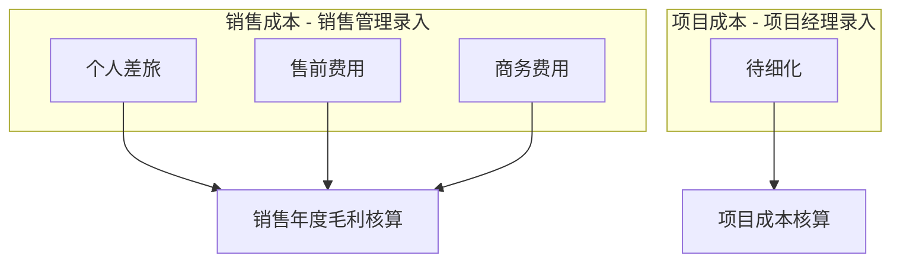


---

#### 7.1 销售成本录入（销售管理人员操作）

销售管理为每位销售录入成本，分三种类型，**一次录入选一种类型**，填写对应明细：

##### 类型一：个人差旅费用

销售个人出差产生，按费用子类填报：


| 子类  | 说明            |
| --- | ------------- |
| 住宿  | 酒店/住宿费用       |
| 交通  | 机票/高铁/打车等     |
| 餐饮  | 餐费            |
| 其他  | 其他差旅杂费（可配置扩展） |


| 公共字段  | 说明              |
| ----- | --------------- |
| 关联销售  | 费用归属销售          |
| 费用日期  | 发生日期            |
| 各子类金额 | 分项填写，**合计为总金额** |
| 说明    | 差旅事由            |


##### 类型二：售前费用

销售申请售前人员协助产生的费用，分两部分：

**人员费用（自动计算）**：


| 字段   | 说明              |
| ---- | --------------- |
| 售前人员 | 从后台维护的售前人员列表选择  |
| 协助天数 | 售前人员参与天数        |
| 日单价  | 自动带入该售前人员的配置单价  |
| 人员费用 | 自动计算 = 天数 × 日单价 |


**售前差旅费用**（分项填报，同个人差旅）：


| 子类                | 说明          |
| ----------------- | ----------- |
| 住宿 / 交通 / 餐饮 / 其他 | 售前人员出差产生的费用 |


- 售前费用总金额 = 人员费用 + 售前差旅合计

##### 类型三：商务费用


| 字段   | 必填  | 说明            |
| ---- | --- | ------------- |
| 关联销售 | ✅   | 费用归属销售        |
| 关联客户 | ✅   | 指定到具体客户       |
| 金额   | ✅   | 商务费用金额        |
| 费用日期 | ✅   | 发生日期          |
| 说明   |     | 费用描述（如招待、礼品等） |


---

#### 7.2 售前人员来源（人员管理模块）

售前人员不再单独维护，在**人员管理**中为人员打「**售前**」标签：


| 字段   | 说明                                   |
| ---- | ------------------------------------ |
| 售前标签 | `isPresales = true` 的人员出现在售前费用录入下拉列表 |
| 日单价  | 在人员档案中维护，录入售前费用时自动带入                 |


#### 7.2.1 售前工作安排（MVP — 项目管理员）

项目管理员直接安排售前支援：


| 字段      | 说明           |
| ------- | ------------ |
| 售前人员    | 从带售前标签的人员中选择 |
| 关联销售    | 需要支援的销售      |
| 关联客户    | 支援的客户        |
| 开始/结束日期 | 工作时间段        |
| 说明      | 安排备注         |


> **后续扩展**（暂不纳入 MVP）：销售/销售管理发起 → 项目管理员与售前确认 → 自动生成流程

---

#### 7.3 项目成本录入（项目经理操作）✅ MVP 简化版

项目经理录入项目实施过程中产生的成本，MVP 先做简单录入：


| 字段   | 必填  | 说明                            |
| ---- | --- | ----------------------------- |
| 关联项目 | ✅   | 费用归属哪个项目                      |
| 成本类别 | ✅   | 差旅 / 人力 / 外包 / 其他（**配置模块维护**） |
| 金额   | ✅   | 费用金额                          |
| 费用日期 | ✅   | 发生日期                          |
| 说明   |     | 费用描述                          |
| 录入人  | ✅   | 自动记录当前项目经理                    |


- 计入项目成本汇总，在项目详情页展示成本列表和合计
- 不影响销售个人年度毛利，用于项目级成本跟踪
- 后续可扩展为分项明细录入

---

#### 7.4 权限与页面


| 角色    | 销售成本      | 项目成本      | 人员/售前           |
| ----- | --------- | --------- | --------------- |
| 销售管理  | 录入/查看团队全部 | 不可见       | 不可见             |
| 项目管理员 | 不可见       | 查看        | **人员管理、售前工作安排** |
| 项目经理  | 不可见       | 录入/查看自己项目 | 查看团队成员          |
| 销售    | 只读自己的成本汇总 | 不可见       | 不可见             |
| 管理员   | 全部        | 全部        | 全部              |


```
/sales-costs              → 销售成本列表
/sales-costs/new          → 新增（选择类型：个人差旅/售前/商务）
/project-costs            → 项目成本列表（项目经理）
/personnel                → 人员管理（项目管理员）
/personnel/daily          → 人员每日工作视图
/presales-assignments     → 售前工作安排（项目管理员）
```

#### 7.5 毛利核算（更新）

```
销售年度毛利 = 合同毛利总和 − 销售成本总和

销售成本总和 = 个人差旅 + 售前费用 + 商务费用
```

- 销售仪表盘年度毛利指标扣减上述三类销售成本
- 可按类型查看成本构成（差旅 / 售前 / 商务占比）

---

### 8. 人员管理模块 ✅ 已确认（v2）

> 所有系统用户均可配置。按**人员大类**分属不同管理者：

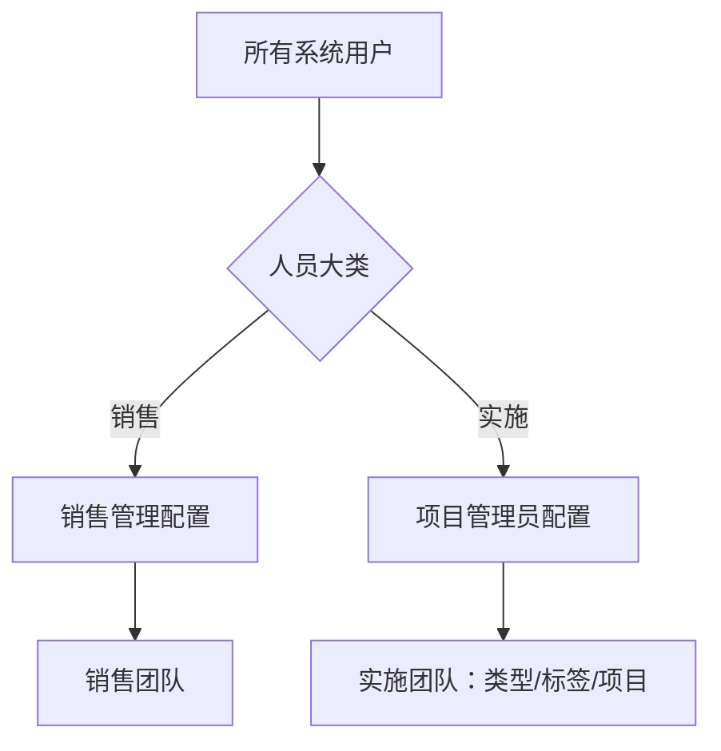


| 人员大类 | 管理者       | 管理入口               |
| ---- | --------- | ------------------ |
| `销售` | **销售管理**  | `/sales-personnel` |
| `实施` | **项目管理员** | `/personnel`       |


- 管理员创建用户时指定人员大类（或后续调整）
- 只有大类为「实施」的用户才会出现在项目管理员的人员管理列表中
- 只有大类为「销售」的用户才会出现在销售管理的销售人员配置中

---

#### 8.1 销售人员配置（销售管理）

销售管理负责维护**大类 = 销售**的用户：


| 字段   | 说明                              |
| ---- | ------------------------------- |
| 姓名   | 系统用户姓名                          |
| 登录账号 | 邮箱/账号                           |
| 登录角色 | 通常为 `SALES`，也可为 `SALES_MANAGER` |
| 是否启用 | 停用后不可登录                         |
| 年度目标 | 可快捷设定销售额/毛利/回款目标                |


- 销售管理人员可查看团队所有销售
- 与 CRM 客户归属、公海池分配联动
- **不**出现在项目管理员的人员管理中

#### 8.2 实施人员管理（项目管理员）

项目管理员负责维护**大类 = 实施**的用户：


| 字段   | 说明                                                    |
| ---- | ----------------------------------------------------- |
| 姓名   | 系统用户姓名                                                |
| 登录账号 | 邮箱/账号                                                 |
| 登录角色 | `PROJECT_ADMIN` / `PROJECT_MANAGER` / `PROJECT_STAFF` |
| 人员类型 | `项目经理` / `咨询` / `实施` / `开发`                           |
| 售前标签 | 是否售前人员（`isPresales`）                                  |
| 日单价  | 有售前标签时必填，用于售前费用计算                                     |
| 是否启用 | 停用后不可分配到项目                                            |


- 人员类型用于项目团队组建
- 售前标签 → 出现在售前费用录入、售前工作安排
- **不**出现在销售管理的销售人员列表中

#### 8.3 项目团队配置（项目管理员）

仅从**实施大类**人员中选择：


| 操作      | 说明                      |
| ------- | ----------------------- |
| 指定项目经理  | 从实施人员中选一位，人员类型通常为「项目经理」 |
| 添加团队成员  | 选择咨询/实施/开发人员            |
| 兼任项目经理  | 项目管理员可将自己设为项目经理         |
| 调整/移除成员 | 项目进行中可调整                |


#### 8.4 人员每日工作视图（项目管理员）

仅展示**实施大类**人员的工作情况：


| 视图     | 内容                    |
| ------ | --------------------- |
| 今日概览   | 每位实施人员今天在哪个项目、完成了哪些任务 |
| 按人员查看  | 某人日期范围内的任务与项目参与       |
| 按项目查看  | 某项目团队成员的当日/当周动态       |
| 售前工作安排 | 进行中的售前支援（售前标签人员）      |


#### 8.5 权限


| 角色    | 销售人员配置        | 实施人员管理 | 团队配置 | 每日工作视图 |
| ----- | ------------- | ------ | ---- | ------ |
| 销售管理  | ✅ CRUD        | 不可见    | 不可见  | 不可见    |
| 项目管理员 | 不可见           | ✅ CRUD | ✅    | ✅      |
| 管理员   | ✅ 全部用户 + 大类分配 | ✅      | ✅    | ✅      |


#### 8.6 页面

```
# 销售管理
/sales-personnel            → 销售人员列表与配置

# 项目管理员
/personnel                  → 实施人员列表与档案
/personnel/[id]             → 实施人员详情
/personnel/daily            → 实施人员每日工作视图
/presales-assignments       → 售前工作安排

# 管理员
/admin/users                → 全部用户 + 人员大类分配 + 登录角色
```

---

### 9. 销售每日日志（Agent 对话）✅ 已确认（v2 · 参考 PyNN Prompt）

> **销售在手机端**通过与 AI 销售助理对话录入每日日志。Agent 遵循「**先倾听、后精准追问**」原则，禁止流水账式填表，对话结束后生成三份结构化产出并入库。

#### Agent 角色与原则

| 原则 | 说明 |
|------|------|
| 先听后问 | 必须先让销售自由描述 2-3 句话，再追问 |
| 单步追问 | 每次只问**一个**最关键的问题，语音友好 |
| 一句话确认 | 总结核心事实；多客户时明确当前追问对象 |
| 零容忍模糊 | 「聊得不错」「大概」等必须追问具体事实 |
| 区分新老客户 | 新客户完整背景 + 核验；老客户只补今日事项 |
| 支持多场景 | 一天多客户、跑空、无客户联系（内部工作）均可生成日报 |
| 公司立场 | Agent 代表公司，使用「公司要求」「公司规定」表述 |

#### 对话五阶段工作流

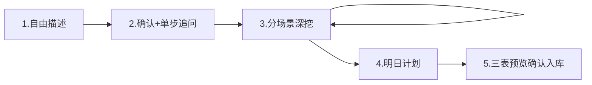

**阶段 1 — 强制开场**（用户进入日志即输出，不询问是否开始）：

> 你好，我是公司的 AI 销售助理。请用 **2-3 句话自由描述今天工作情况**——拜访了谁、电话联系了谁、线上演示了什么、有什么进展。像跟同事聊天一样，真实细节更重要。如果**今天无客户联系**，也请直接说。

**阶段 2 — 一句话确认 + 单步追问**：分析自由描述后，用一句话总结，再问当前客户最关键缺失点。

**阶段 3 — 分场景深度追问**（按识别到的场景进入）：

| 场景 | 触发条件 | 核心流程 |
|------|----------|----------|
| A 医院客户 | 拜访/电话/线上演示医院 | 新老判定 → 全称核验（搜索/OCR）→ 重复预警 → 联系人 → 往来方式 → 痛点 → 成熟度 → 下次行动 → 循环问其他工作 |
| B 渠道客户 | 拜访/电话/线上渠道公司 | 新老判定 → 工商搜索+截图 OCR → 重复预警 → 渠道背景 → 联系人 → 资源验真 → 带见意向 → 循环 |
| C 跑空 | 未见到人 | 原计划/原因/下次计划/侧面情报 → 循环 |
| D 无客户联系 | 内部工作 | 工作类型/内容/成果 → 进入明日计划 |

**医院新客户核验**：先联网搜索 → 搜不到则请销售上传截图（卫健委/官网/企查查）OCR 识别 → 与系统客户库**重复预警**。

**渠道新客户核验**：搜索 + 截图 OCR 核对工商信息。

**阶段 4 — 明日计划**（强制）：必须包含**具体事项 + 预计成果**，拒绝「继续跟进」等敷衍，需追问跟哪家、谈什么、预计结果。

**阶段 5 — 三表预览 + 入库**：信息不全时提供「再补 2 分钟」或「带风险生成（抄送主管）」选项。

#### 三表产出与 CRM 映射

| Agent 输出表 | 入库目标 | 触发条件 |
|-------------|----------|----------|
| **表1：客户档案** | `Customer` + `Contact` + 自定义字段 | 有**新增**客户时 |
| **表2：往来记录** | `FollowUp` + `FaceVisitDetail`（面访时） | 有客户工作时（可多条） |
| **表3：日报汇总** | `SalesDailyLog`（日报正文 + 结构化 JSON） | **每天都生成** |

**表1 客户档案 → 系统字段映射**：

| Prompt 字段 | CRM 字段 |
|------------|----------|
| 客户名称 | 客户名称 |
| 客户标签 医院/渠道 | 客户类别：`医院` / `公司` |
| 所在区域 | 所在地区 |
| 医院等级 | 医院等级 |
| 企业地址/电话等 | 对应内置或自定义字段 |
| 关联客户 | 关联客户（渠道介绍关系） |
| 客户等级 无意向/潜在/意向 | 建议客户状态：线索/意向/洽谈中 |
| 备注/关键人 | 联系人 + 备注 |

> 直接/间接客户**不在客户层体现**；渠道场景通过「关联客户」记录，签约方式在合同层处理。

**表2 往来记录 → 系统字段映射**：

| Prompt 字段 | CRM 字段 |
|------------|----------|
| 往来方式 拜访/电话/线上演示等 | 跟进方式（面访时展开面访专属字段） |
| 往来内容 | 跟进内容 / 详细面访纪要 |
| 意向等级 H/M/L/N | 跟进结果（配置映射） |
| 下次计划时间/内容 | 下次跟进时间 + 跟进内容 |
| 联系人 | 关联联系人 |
| 开始时间 | 跟进时间 |

**表3 日报汇总**：保存完整 Markdown 日报 + 结构化统计（拜访数/电话数/跑空数/问题汇总/明日计划）。

#### Agent 工具（Function Calling）

| 工具 | 用途 |
|------|------|
| `searchCustomers` | 在 CRM 中模糊搜索已有客户，重复预警 |
| `webSearch` | 联网搜索医院/企业信息（新客户核验） |
| `ocrImage` | 识别上传截图（卫健委/企查查/天眼查） |
| `getSalesContext` | 获取当前销售负责的客户列表、本周任务 |
| `draftOutputs` | 生成三表结构化草稿供预览 |

#### 快捷指令（手机端可点选或语音说出）

`新客户` `老客户` `医院` `渠道` `拜访` `电话` `线上演示` `跑空` `还有一家` `截图` `搜索` `太模糊了` `带风险生成` `生成日报`

#### 对话采集流程（技术）

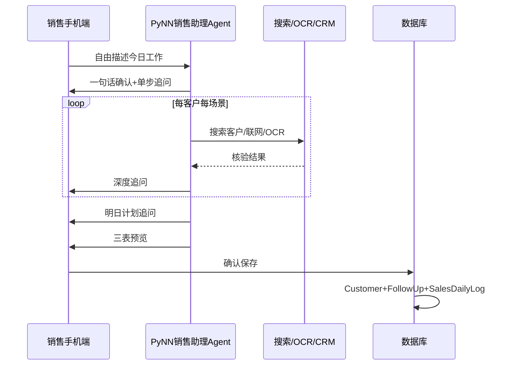

#### 手机端设计要点

- **移动优先**：销售主操作在手机端完成
- 聊天式 UI，支持**语音转文字**
- 支持**拍照/上传截图**供 OCR
- 日志状态：未开始 / 对话中 / 待确认 / 已提交 / 带风险提交
- 销售管理查看团队：今日是否已交日志、带风险标记的日志

#### 权限

| 角色 | 权限 |
|------|------|
| 销售 | 自己的日志对话、上传截图、确认入库 |
| 销售管理 | 查看团队日志与日报、带风险日志抄送提醒 |
| 其他角色 | 不可见 |

#### 页面与 Prompt 文件

```
/mobile/log                 → Agent 对话主入口（强制开场白）
/mobile/log/history         → 历史日报列表
/mobile/log/[id]            → 某日日报详情（三表内容）

src/lib/agent/sales-log-prompt.ts   → Agent System Prompt（基于 PyNN Prompt 适配 CRM）
```

#### 技术实现要点

- Vercel AI SDK + 流式对话 + Tool Calling
- System Prompt 固化 PyNN 工作流（五阶段、四场景、三表格式），并按本公司 CRM 字段适配
- 保存事务：`SalesDailyLog` + 批量 `Customer`（新增）+ 批量 `FollowUp`（+ `FaceVisitDetail`）
- 带风险提交：`SalesDailyLog.riskFlag = true`，销售管理仪表盘高亮

#### 暂不纳入 MVP（日志相关）

- 售前申请审批流程（销售发起 → 项目管理员确认）
- 日志语音离线缓存

---

## 功能模块（概要）

### CRM 模块（销售团队）

#### 1. 销售仪表盘

- 今日待跟进客户数
- 本月新增客户、签约合同数
- 近期跟进提醒
- 已签约但项目未启动的合同提醒

#### 2. 客户管理

- 客户列表：按医院名称、状态、来源筛选
- 字段：联系人、医院名称、电话、邮箱、来源、备注
- 客户详情：跟进历史（含面访）、关联合同

#### 3. 客户跟进（含面访）

- 所有跟进方式统一入口，面访为其中一种
- 面访额外记录：地点、科室、同行人员、出发/返回时间、详细纪要、GPS 定位
- 待跟进提醒 + 客户状态变更建议

#### 4. 合同管理（含项目联动）

- 合同 CRUD：标题、金额、签约/到期日期
- **合同详情页新增「项目实施」Tab**（只读）：
  - 当前实施阶段名称
  - 整体进度百分比
  - 各阶段完成状态时间线
  - 最近 5 条任务动态
- 合同状态变为「已生效」时，显示「创建关联项目」按钮（通知项目经理）

### 项目管理模块（实施团队）

#### 1. 项目仪表盘

- 进行中项目数、本月验收项目数
- 逾期任务预警
- 各阶段项目分布
- 团队成员工作量概览

#### 2. 项目管理

- 项目列表：按状态、医院名称、项目经理筛选
- 新建项目：关联合同/客户，指定项目经理，自动创建 6 个标准阶段
- 项目详情页：
  - **概览**：进度条、计划/实际时间、团队成员
  - **阶段**：各阶段状态切换、计划/完成日期
  - **任务**：阶段下任务列表
  - **动态**：任务状态变更日志

#### 3. 任务管理

- 项目经理：创建任务、分配项目人员、设置优先级和截止日期
- 项目人员：「我的任务」视图，更新任务状态和备注
- 任务可关联到具体实施阶段

#### 4. 团队成员

- 项目经理为项目添加/移除成员（项目人员）
- 成员只能看到自己有权限的项目

## 页面结构

```
# 公共
/login                          → 登录

# 销售角色菜单
/                               → 销售仪表盘
/customers                      → 客户列表（含公海池 Tab）
/customers/pool                 → 公海池管理（销售管理专用）
/customers/[id]                 → 客户详情
/follow-ups                     → 待跟进
/contracts                      → 合同列表
/contracts/[id]                 → 合同详情（含项目实施 Tab，只读）

# 项目管理员 / 项目经理 / 项目人员菜单
/projects                       → 项目列表（项目管理员看全部）
/personnel                      → 人员管理（项目管理员）
/personnel/daily                → 每日工作视图
/presales-assignments           → 售前工作安排
/projects/[id]                  → 项目详情（阶段 + 任务）
/projects/[id]/tasks            → 项目任务管理
/my-tasks                       → 我的任务（项目人员）

# 管理员
/admin/users                    → 用户与角色管理
/admin/settings/fields          → 字段配置
/admin/settings/permissions     → 权限配置
/admin/settings/enums           → 枚举/选项配置
```

侧边栏根据登录用户角色动态渲染菜单项。

## 跨模块数据流

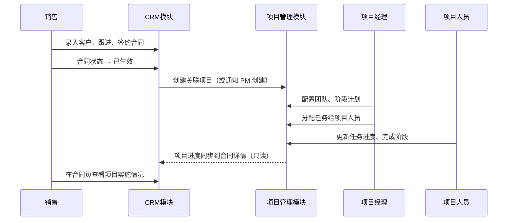


## 项目目录结构（预期）

```
hospital-crm-pm/
├── prisma/
│   └── schema.prisma
├── src/
│   ├── app/
│   │   ├── (auth)/login/
│   │   ├── (crm)/                    # 销售模块路由组
│   │   │   ├── page.tsx              # 销售仪表盘
│   │   │   ├── customers/
│   │   │   ├── follow-ups/
│   │   │   └── contracts/
│   │   ├── (pm)/                     # 项目管理路由组
│   │   │   ├── projects/
│   │   │   └── my-tasks/
│   │   ├── admin/users/
│   │   └── api/
│   ├── components/
│   │   ├── ui/
│   │   ├── crm/
│   │   ├── pm/
│   │   └── shared/                   # 项目进度卡片等跨模块组件
│   └── lib/
│       ├── prisma.ts
│       ├── auth.ts
│       └── permissions.ts            # 角色权限检查
├── package.json
└── README.md
```

## 实施步骤

### 阶段一：脚手架 + 数据模型

1. 创建 `~/Projects/hospital-crm-pm` Next.js 项目
2. 安装依赖：Prisma、NextAuth、shadcn/ui
3. 定义完整 Prisma schema（User/Customer/Contract/Project/Phase/Task）
4. 种子数据：默认管理员账号 + 标准 6 阶段模板

### 阶段二：认证与角色权限

1. NextAuth 邮箱密码登录
2. User 模型 `role` 字段（SALES / SALES_MANAGER / PROJECT_ADMIN / PROJECT_MANAGER / PROJECT_STAFF / ADMIN）
3. 路由中间件：按角色拦截未授权页面
4. 动态侧边栏导航

### 阶段三：CRM 模块

1. 客户 CRUD + 关联客户 + 公海池
2. 跟进记录（含面访扩展字段）+ 待跟进列表
3. 合同 CRUD + 状态流转
4. 合同详情「项目实施」只读 Tab（调用项目 API）

### 阶段四：项目管理模块

1. 项目 CRUD，签约合同一键创建项目
2. 从合同产品/服务合并生成项目阶段，项目经理可自定义
3. 支持并行阶段（parallelGroup），阶段状态管理 + 进度自动计算
4. 项目成员管理

### 阶段五：任务管理

1. 任务 CRUD，关联阶段和项目
2. 项目经理分配任务界面
3. 项目人员「我的任务」视图
4. 任务状态变更记录

### 阶段六：仪表盘 + 收尾

1. 销售仪表盘 + 项目仪表盘
2. 合同页项目实施联动展示
3. 响应式布局（手机端面访 GPS 打卡）
4. README 中文使用说明

## 暂不纳入 MVP（可后续扩展）

- 合同/项目文件附件上传（合同 PDF、验收报告）
- 微信/邮件通知（跟进提醒、任务到期）
- 医院科室级需求调研表单
- 项目工时统计与报表
- 销售漏斗可视化
- 与医院 HIS 系统对接
- 操作审计日志
- 售前申请流程：销售/销售管理发起 → 项目管理员与售前确认 → 自动生成工作安排
- 销售日志语音输入离线缓存

## 生产部署方案（国内云 · 小团队）

> 适用规模：< 30 人；部署环境：**阿里云 / 腾讯云**（二选一，架构相同）

### 推荐架构

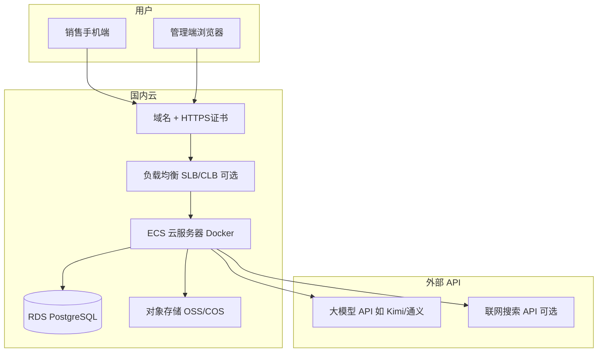

小团队可**单机部署**：1 台 ECS 跑应用容器 + 1 个托管 RDS，无需 Kubernetes。

### 云服务清单

| 组件 | 阿里云 | 腾讯云 | 规格建议（小团队） |
|------|--------|--------|-------------------|
| 应用服务器 | ECS | CVM | 2核4G 或 4核8G，40G 系统盘 |
| 数据库 | RDS PostgreSQL | TencentDB PostgreSQL | 1核2G 入门版，自动备份 |
| 文件存储 | OSS | COS | 标准存储，存放合同附件/日志截图 |
| 域名解析 | 云解析 DNS | DNSPod | 绑定企业域名 |
| HTTPS | 免费 SSL 证书 | 免费 SSL 证书 | 强制 HTTPS |
| 负载均衡 | SLB（可选） | CLB（可选） | 初期可省略，ECS 直连 |

### 应用部署方式（Docker）

使用 Next.js `standalone` 输出 + Docker Compose 一键部署：

```
hospital-crm-pm/
├── Dockerfile
├── docker-compose.prod.yml
├── nginx.conf                  # 反向代理（可选，或用 Caddy）
└── .env.production             # 生产环境变量（不入库）
```

**`docker-compose.prod.yml` 核心服务**：

| 服务 | 说明 |
|------|------|
| `app` | Next.js 应用（端口 3000） |
| `nginx` | 反向代理，HTTPS 终结，静态资源缓存（可选） |

> 数据库使用云 RDS，**不**在 ECS 上自建 PostgreSQL（省心、自动备份）。

### 环境变量（生产）

| 变量 | 说明 |
|------|------|
| `DATABASE_URL` | RDS PostgreSQL 连接串 |
| `NEXTAUTH_SECRET` | 随机密钥，用于 Session 加密 |
| `NEXTAUTH_URL` | 生产域名，如 `https://crm.example.com` |
| `LLM_API_KEY` | 大模型 API Key（建议 Kimi/通义，与 Agent Prompt 配套） |
| `LLM_API_BASE` | 模型 API 地址 |
| `OSS_ACCESS_KEY` / `OSS_SECRET` / `OSS_BUCKET` / `OSS_REGION` | 对象存储（截图、附件） |
| `SEARCH_API_KEY` | 联网搜索 API（新客户核验，可选） |

### 部署步骤概要

1. **购买资源**：ECS + RDS PostgreSQL + OSS + 域名
2. **初始化 RDS**：创建数据库 `hospital_crm`，配置白名单仅允许 ECS 内网 IP
3. **配置 OSS**：创建 Bucket，配置 CORS 允许前端直传（附件/截图）
4. **ECS 初始化**：安装 Docker + Docker Compose，配置防火墙（仅开放 80/443）
5. **构建镜像**：`docker build -t hospital-crm-pm .`
6. **数据库迁移**：容器启动前执行 `npx prisma migrate deploy`
7. **启动服务**：`docker compose -f docker-compose.prod.yml up -d`
8. **配置 HTTPS**：Nginx/Caddy 挂载 SSL 证书，强制跳转 HTTPS
9. **种子数据**：首次部署执行 `prisma db seed`（管理员账号、默认配置）

### 更新发布流程

```bash
# 在 ECS 上
git pull
docker build -t hospital-crm-pm .
npx prisma migrate deploy    # 有 schema 变更时
docker compose -f docker-compose.prod.yml up -d --no-deps app
```

### 安全与运维建议

| 项 | 建议 |
|----|------|
| 网络 | RDS 仅内网访问；ECS 安全组限制 SSH 来源 IP |
| 备份 | RDS 开启每日自动备份；OSS 开启版本控制 |
| 日志 | ECS 应用日志 + 阿里云 SLS/腾讯云 CLS（可选） |
| 监控 | 云监控告警：CPU/内存/磁盘/RDS 连接数 |
| 手机端 | 销售通过 HTTPS 域名访问 `/mobile/log`，可添加为 PWA 桌面快捷方式 |

### 费用估算（小团队参考）

| 项目 | 月费约 |
|------|--------|
| ECS 2核4G | ¥80-150 |
| RDS PostgreSQL 入门 | ¥100-200 |
| OSS + 流量 | ¥10-50 |
| 大模型 API 按量 | ¥50-300（取决于日志使用量） |
| **合计** | **¥250-700/月** |

### 本地开发 vs 生产

| 环境 | 数据库 | 文件 | 模型 |
|------|--------|------|------|
| 本地开发 | SQLite | 本地磁盘 | API Key 调云端模型 |
| 生产 | RDS PostgreSQL | OSS/COS | 同上 |

## 本地运行

```bash
cd ~/Projects/hospital-crm-pm
npm install
npx prisma migrate dev
npx prisma db seed
npm run dev
# 访问 http://localhost:3000
```

## 风险与假设

- 界面全部使用中文
- 一个合同对应一个项目（1:1），暂不支持一个合同拆多个子项目
- 项目阶段由产品/服务配置驱动，支持并行阶段和项目经理自定义
- 小团队规模（< 50 用户，< 500 项目），SQLite 开发足够

