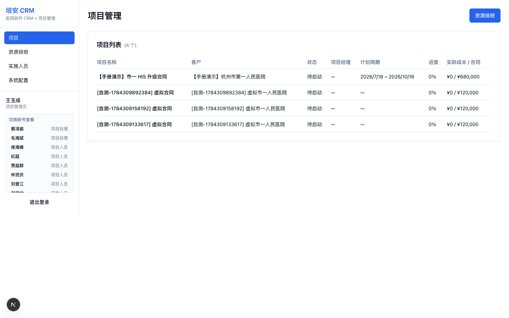
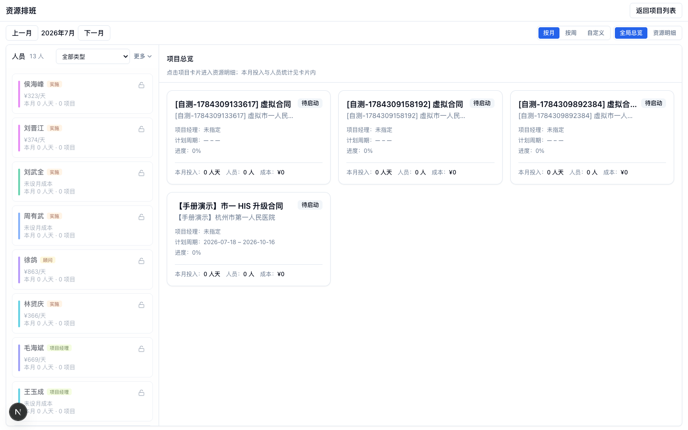
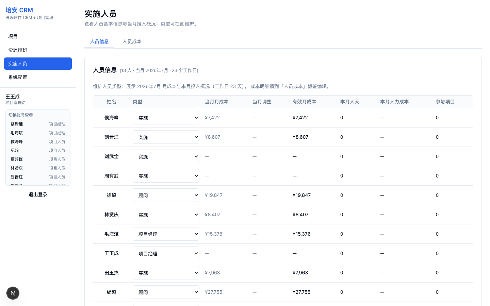

# 项目侧操作手册（项目管理员）

适用角色：**项目管理员（PROJECT_ADMIN）**。  
端：**仅电脑端**。手机打开会提示使用电脑端。

> 项目由销售侧 **合同签署通过** 后自动创建，项目管理员不在系统里「手工新建空项目」。  
> 手册截图含「【手册演示】市一 HIS 升级合同」等本地演示项；可用销售侧演示脚本签约通过后自动出现。

---

## 1. 登录与入口

1. 使用手机号 + 密码在电脑浏览器登录（首次需企微激活）。  
2. 默认进入 **项目** 列表（`/projects`）。  
3. 若用手机打开系统：提示「请使用电脑端」；请改用电脑浏览器。  
4. 管理员可在侧栏「切换账号查看」切入项目管理员视角做培训演示。

侧栏菜单（项目管理员）：

| 菜单 | 说明 |
|------|------|
| 项目 | 项目列表与详情 |
| 资源排班 | 全员/全局排班总览 |
| 实施人员 | 人员类型与成本 |
| 系统配置 | 项目字段、项目模型等 |



若列表为空，会提示「合同签署通过后会自动创建项目」——说明销售侧合同尚未通过，属正常。

---

## 2. 主流程 A：合同通过后接收项目

前置（销售侧完成）：

1. 销售提交合同 → 销售管理审批通过；**或**  
2. 销售管理免审创建并签署合同。

项目侧验证：

1. 打开 **项目**，列表出现对应新项目（通常关联客户/合同信息）。  
2. 进入项目详情，确认概览中的客户、合同、状态正确。

---

## 3. 主流程 B：项目详情四块工作

进入某个项目后，常见 Tab：

### 3.1 概览

- 查看计划起止、备注、状态、客户/合同摘要、成本卡片。  
- 项目管理员可编辑允许的概览字段（计划日期、备注、状态等，以页面可编辑项为准）。  
- **建议先填计划开始/结束日期**，否则项目计划页甘特图无法展示。

### 3.2 项目计划

1. 在概览填写计划起止日期后，进入「项目计划」。  
2. 选择启用中的 **项目模型**（模板来自系统配置），或按阶段维护计划。  
3. 维护阶段与阶段任务；为任务指定执行人（人选一般来自已排班/实施人员）。  
4. 需要排人力时，从计划跳转 **资源排班**。

签约通过后自动建项时，可能已带有初始阶段/任务（示例如下）：


### 3.3 资源排班（项目内）

1. 在项目内「资源排班」Tab，或顶部进入全局排班。  
2. 将实施人员分配到阶段/日期区间。  
3. 注意人天与成本展示；冲突时按页面提示调整。

### 3.4 发生费用

- 查看项目成本汇总与明细（与排班人天、费率相关）。  
- 用于复盘投入，不替代财务系统。

---

## 4. 主流程 C：全局资源排班

入口：侧栏 **资源排班**。



常用操作：

1. 切换 **按月 / 按周 / 自定义** 时间范围。  
2. 在左侧人员列表查看日费率、本月人天与项目数。  
3. 按类型筛选：实施 / 顾问 / 项目经理等。  
4. **全局总览**：按项目卡片查看投入；点入 **资源明细** 做人天分配。  
5. 「锁定此人」用于排班时固定关注对象（以页面行为为准）。  
6. 「返回项目列表」回到项目管理。

有已建项目时，右侧可按项目卡片查看投入；无项目时显示「暂无可见项目」，需先完成销售侧签约建项。

---

## 5. 主流程 D：实施人员

入口：侧栏 **实施人员**。



### 5.1 人员信息

1. 查看实施相关人员名单。  
2. 维护 **人员类型**（项目经理 / 顾问 / 实施 / 开发等）。  
3. 查看当月月成本与投入概况（工作日天数以页面为准）。

### 5.2 人员成本

1. 切换到「人员成本」标签。  
2. 维护/调整月度成本明细（费率、调整项）。  
3. 排班与费用页会引用有效月成本。

---

## 6. 主流程 E：系统配置（项目相关）

入口：侧栏 **系统配置**（项目管理员可见项目相关项）。

典型内容：

- 项目管理相关字段选项（如费用类别等）  
- **项目模型**：阶段/任务模板、启用/停用  

注意：

- 销售类配置（产品服务、KPI、日志助手等）一般由销售管理/管理员维护。  
- 企微、AI、高德等全局项通常仅管理员配置。

建议：新建项目模型并启用后，再在项目计划中选用。

---

## 7. 账号切换（项目管理员）

- 项目管理员可在侧栏切换到 **项目经理 / 项目人员**，用于查看一线视角。  
- 不可切换到销售侧角色（与销售管理对称）。  
- 切换后可「退出切换，回到原账号」。

---

## 8. 与销售侧的衔接点

```text
销售新建客户/商机 → 发起合同
        ↓
销售管理审批通过（或销管免审签署）
        ↓
系统自动创建项目
        ↓
项目管理员：计划 → 排班 → 人员成本 → 费用复盘
```

项目侧 **看不到** 客户认领、日报、销售审批等菜单；发现「没有项目」时，优先到销售侧确认合同是否已通过。

---

## 9. 推荐练习路径（约 20 分钟）

1. 确认手机打开出现 pc-only 提示。  
2. 电脑登录进入项目列表。  
3. 请销管完成一单测试合同通过 → 刷新项目列表看到新项。  
4. 打开项目：维护计划阶段 → 全局排班分配一人天。  
5. 实施人员页调整一人类型并查看人员成本页。  
6. 系统配置中确认项目模型为启用状态。
