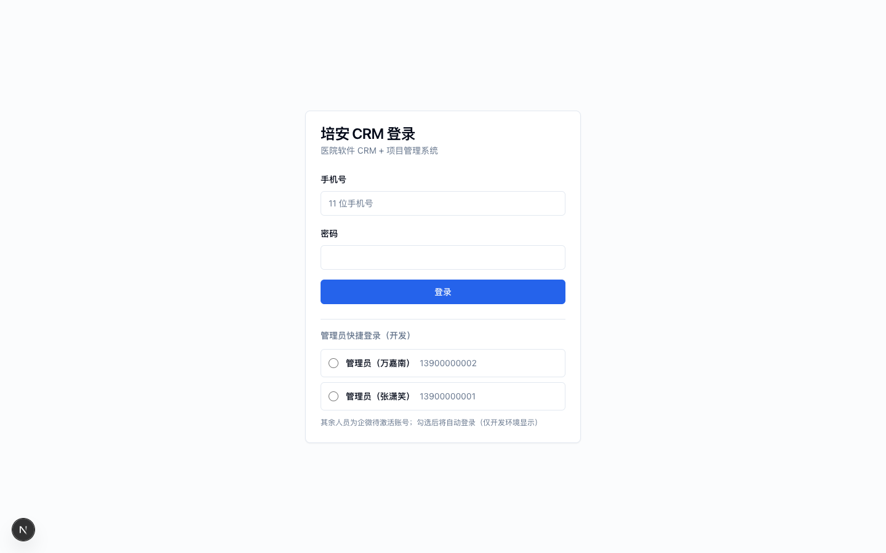
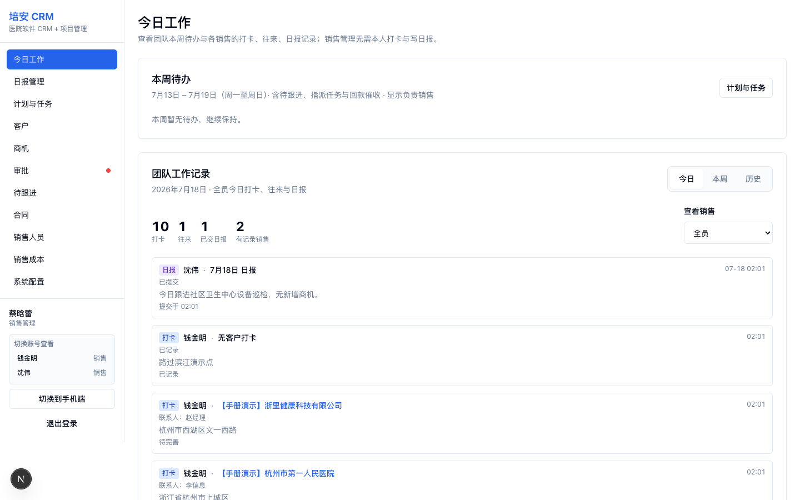
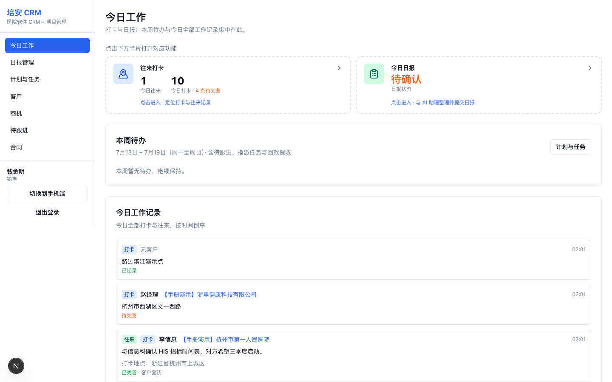
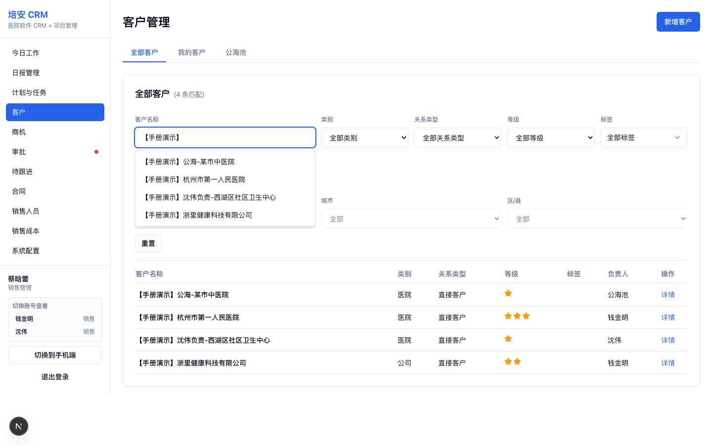
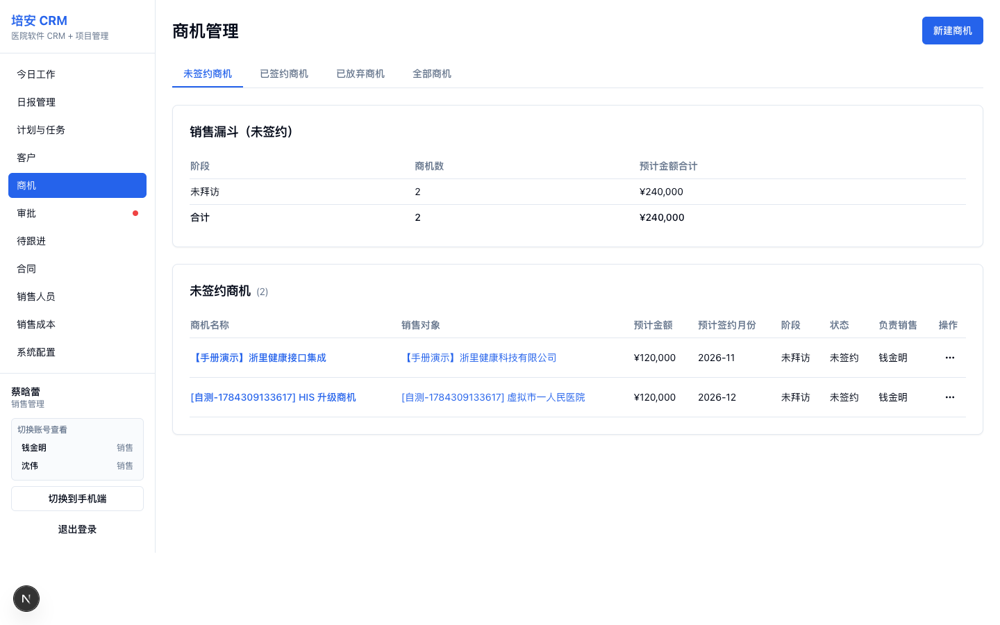
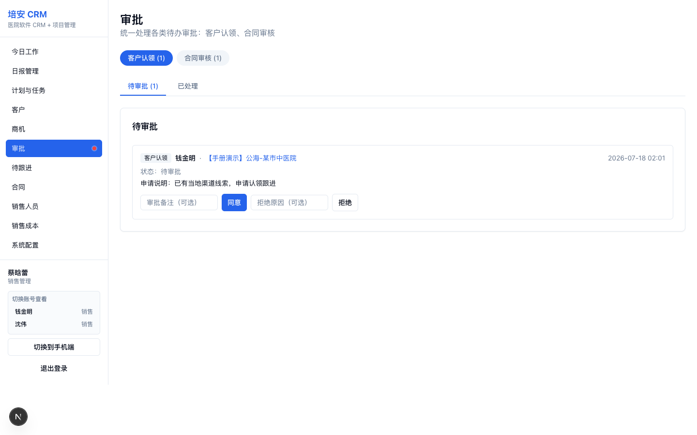
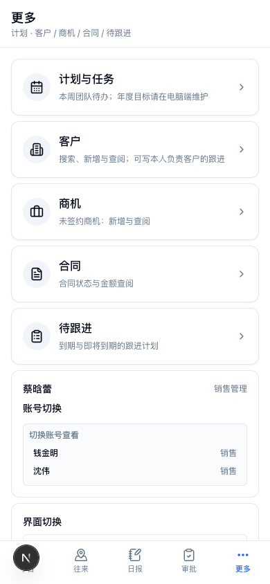

# 销售侧操作手册（销售 / 销售管理）

适用角色：**销售（SALES）**、**销售管理（SALES_MANAGER）**。  
端：电脑端（PC）+ 手机端（含企微内打开）。

> 手册截图使用本地演示数据（客户/商机名带前缀「【手册演示】」）。本地可运行 `npx tsx scripts/seed-manual-demo-data.ts` 生成，再运行 `npx tsx scripts/capture-manual-screenshots.ts` 刷新截图。

---

## 1. 登录与端选择

### 1.1 登录

1. 打开系统地址（本地 `http://localhost:3000`，线上以实际域名为准）。
2. 使用 **手机号 + 密码** 登录；正式人员首次需在企微内完成激活后再用手机号登录。
3. 开发环境可使用管理员快捷登录后，在侧栏「切换账号查看」进入销售/销管视角。

### 1.2 登录后落地

| 场景 | 结果 |
|------|------|
| 电脑浏览器 | 进入电脑端「今日工作」 |
| 手机浏览器 / 企微 | 进入手机端 `/mobile` |
| 项目类角色用手机打开 | 提示「请使用电脑端」 |

### 1.3 PC ↔ 手机切换（调试/对照）

- **电脑端侧栏底部**：「切换到手机端」
- **手机端 → 更多**：「切换到电脑端」

切换会记住偏好；手机默认仍进手机端，除非主动切到电脑端。

---

## 2. 角色菜单对照

### 2.1 电脑端侧栏

| 菜单 | 销售 | 销售管理 |
|------|:----:|:--------:|
| 今日工作 | ✓ | ✓（团队视图） |
| 日报管理 | ✓（本人） | ✓（可按销售切换） |
| 计划与任务 | ✓（执行） | ✓（指派/目标） |
| 客户 | ✓ | ✓（全部/分配） |
| 商机 | ✓ | ✓ |
| 审批 | — | ✓ |
| 待跟进 | ✓ | ✓ |
| 合同 | ✓ | ✓（可免审） |
| 销售人员 / 销售成本 | — | ✓ |
| 系统配置（销售相关） | — | ✓ |

销售管理电脑端今日工作示例（团队视角）：

销售电脑端今日工作示例（本人打卡 + 日报）：

### 2.2 手机端底栏

| 底栏 | 销售 | 销售管理 |
|------|------|----------|
| 第 1 项 | 今日 | 今日 |
| 第 2 项 | 打卡 | **往来** |
| 第 3 项 | 日报（本人写） | **日报**（团队查阅） |
| 第 4 项 | 待办 | **审批** |
| 第 5 项 | 更多 | 更多 |

销售管理手机首页：

销售手机首页：

---

## 3. 主流程 A：拜访打卡与往来（销售日常）

目标：外勤定位 → 关联客户 → 记录往来 →（可选）下次计划。

### 3.1 电脑端

1. 打开 **今日工作** → 点击「往来打卡」卡片。  
2. 选择打卡类型：  
   - **往来打卡**：关联客户与往来内容  
   - **无客户打卡**：只记定位  
3. 搜索并选择客户；没有客户可点「新增客户」。  
4. 选择联系人、往来方式与内容；可关联/新建商机。  
5. 非「长期无意向」客户需填写 **下次往来计划**。  
6. （可选）获取定位后提交。  
7. 若当日有「待完善」打卡，需补全往来后再下班写日报。

### 3.2 手机端

1. 底栏 **打卡** / **往来**，或今日页进入「往来打卡」。  
2. 表单能力与电脑端一致，并支持快捷 **新增客户 / 新建商机**。

### 3.3 销售管理说明

销管 **无需本人写日报**，但仍可进行往来打卡（手机「往来」）。团队打卡与日报请在「日报管理」查阅。

---

## 4. 主流程 B：写日报并提交（销售）

1. **电脑端**：今日工作 →「今日日报」，或侧栏「日报管理」查看历史日。  
2. **手机端**：底栏「日报」→ 与助理对话整理 → 确认提交。  
3. 状态大致为：对话中 → 待确认 → 已提交。  
4. 销管在 PC「日报管理」或手机「日报」中 **按销售切换** 查阅，不替代销售本人提交。

---

## 5. 主流程 C：客户管理

### 5.1 列表与视图

- 销售：常用 **我的客户**、**公海池**。  
- 销售管理：另有 **全部客户**，可按负责人筛选。

### 5.2 新建客户

1. 点「新增客户」（PC）或手机「更多 → 客户 → 新增」。  
2. 填写名称、类别、关系类型、等级等必填项。  
3. 销售新建后负责人一般为本人；销管可指定负责人或放入公海。

### 5.3 公海认领（销售）

1. 进入公海池，打开目标客户。  
2. 提交 **申请认领** → 等待销售管理审批。  
3. 通过后负责人变为申请人；拒绝则仍留在公海。

### 5.4 销管直接分配 / 释放

1. 在客户详情或列表操作中，将公海客户 **分配给销售**。  
2. 可将客户 **释放回公海**（会作废相关 pending 认领）。

### 5.5 客户跟进

1. 打开客户详情 →「客户跟进」/ 跟进页。  
2. 负责人或协助负责人可录入跟进（**与是否写日报无关**）。  
3. 手机：客户详情 →「客户跟进」。

---

## 6. 主流程 D：商机推进

1. **新建商机**：选择销售对象客户 → 标题、阶段、金额、预计签约月。  
2. PC / 手机「更多 → 商机」均可新增与查阅未签约商机。  
3. 跟进商机阶段与往来；准备签约时走合同流程。  
4. **签约 / 放弃** 等复杂操作请在电脑端完成。

---

## 7. 主流程 E：合同与审批

### 7.1 销售发起合同

1. 从商机发起签约或进入「合同」新建。  
2. 填写合同信息、分期回款、附件。  
3. 销售提交后状态为 **待审核**，进入销管审批。  
4. 若被驳回：按意见修改后再次提交。

### 7.2 销售管理审批

1. 电脑端侧栏「审批」，或手机底栏「审批」。  
2. 切换类型：**客户认领** / **合同审核**；标签：**待审批** / **已处理**。  
3. **客户认领**：同意 → 负责人变为申请人；拒绝需可追溯。  
4. **合同审核**：通过 → 合同生效并 **自动创建项目**；驳回填写原因。  

> 销管本人创建的合同通常 **免审**，签署通过后同样自动建项目。

### 7.3 回款与附件

- 已签署合同可登记回款、管理附件（细节以电脑端为准）。  
- 手机端合同以查阅为主。

---

## 8. 主流程 F：计划与任务 / 待跟进

### 8.1 销售

1. 「计划与任务」查看本人周任务与指标（目标由销管维护）。  
2. 「待跟进」处理已到期 / 即将到期的下次往来计划。  
3. 手机底栏「待办」或「更多 → 待跟进」。

### 8.2 销售管理

1. 在「计划与任务」中维护年度/月度目标、指派周任务。  
2. 手机「更多 → 计划与任务」可看本周团队待办；目标维护请用电脑端。

---

## 9. 手机「更多」与账号切换

「更多」中包含：

- 计划与任务（销管）  
- 客户 / 商机 / 合同 / 待跟进  
- **账号切换**（销管可切到销售；管理员可切多角色）  
- **界面切换**（切到电脑端）

---

## 10. 权限速查：销售不能做的事

- 审批中心（认领、合同审核）  
- 直接分配/释放公海（仅申请认领）  
- 编辑已通过合同正文（驳回后可改再提）  
- 设置团队销售目标 / 指派周任务  
- 销售成本、销售人员维护、用户管理  

销售管理不能做：项目排班、实施人员、项目模型等项目侧能力（见项目手册）。

---

## 11. 推荐练习路径（约 30 分钟）

1. 销售：新建客户 → 往来打卡 → 写日报提交。  
2. 销售：公海认领申请。  
3. 销管：审批认领 → 查看团队日报。  
4. 销售：新建商机 → 发起合同提审。  
5. 销管：审批合同 → 通知项目侧查看自动创建的项目。  
6. 两端：在「更多 / 侧栏」练习 PC↔手机切换。
